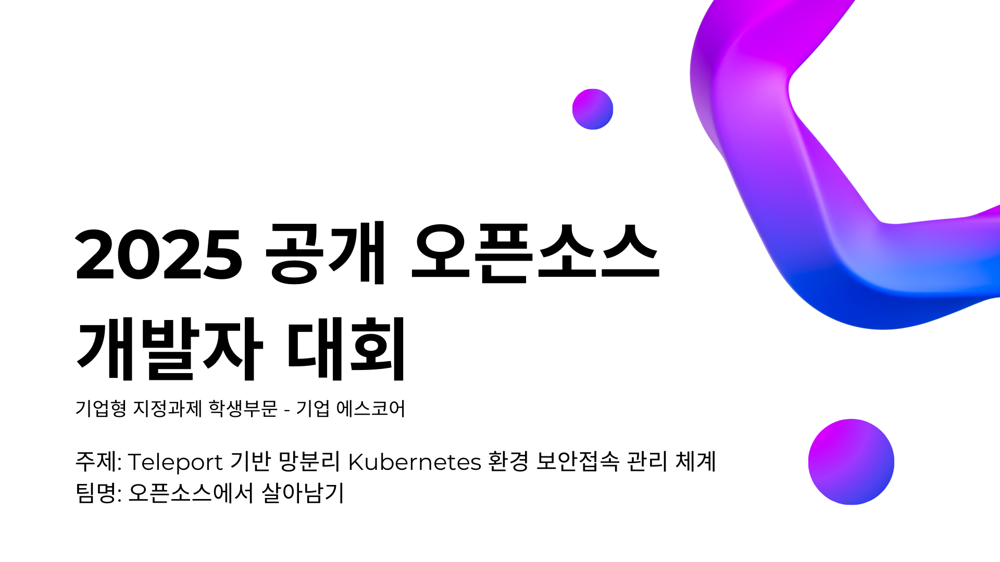
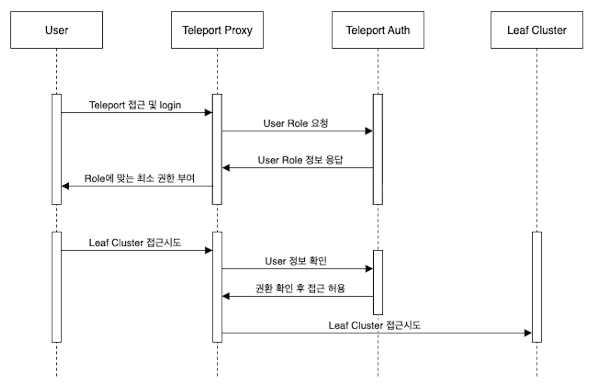
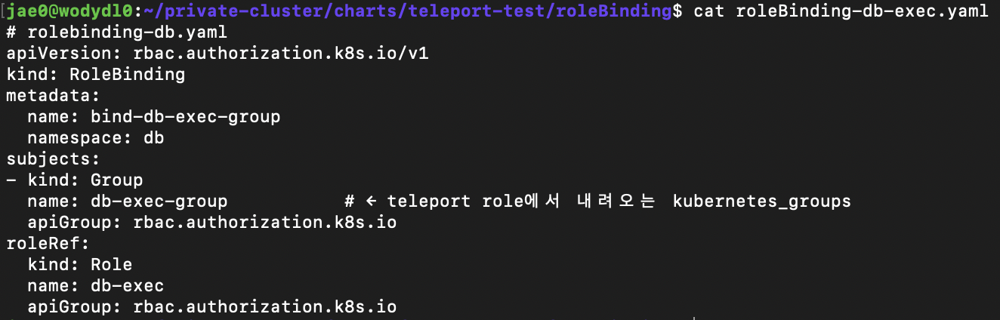
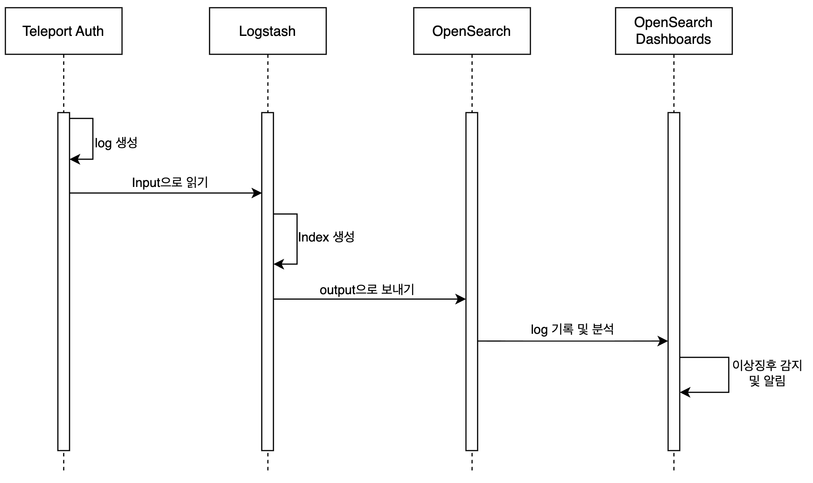
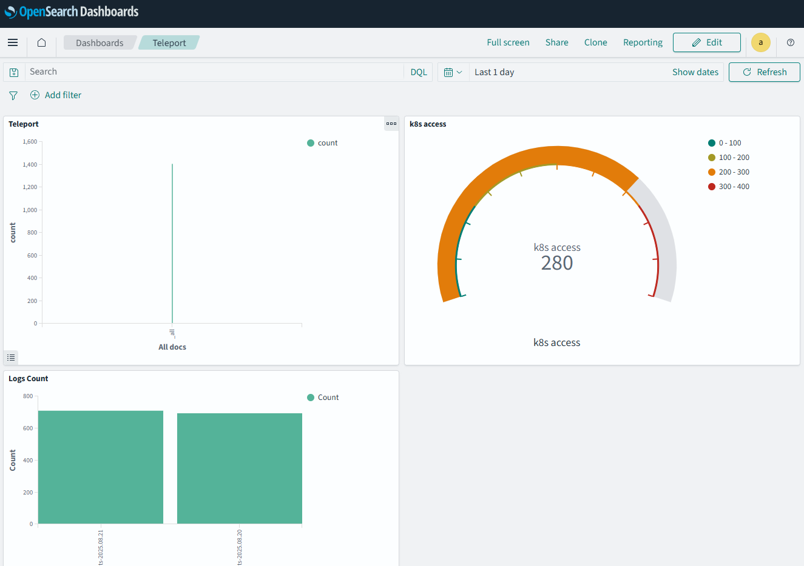
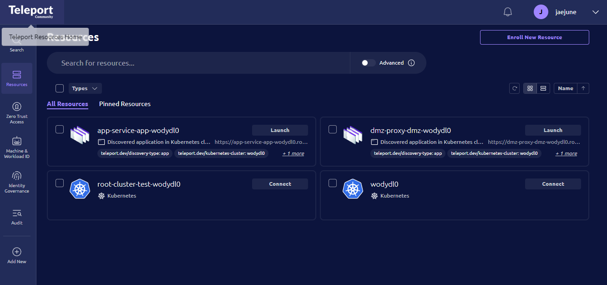
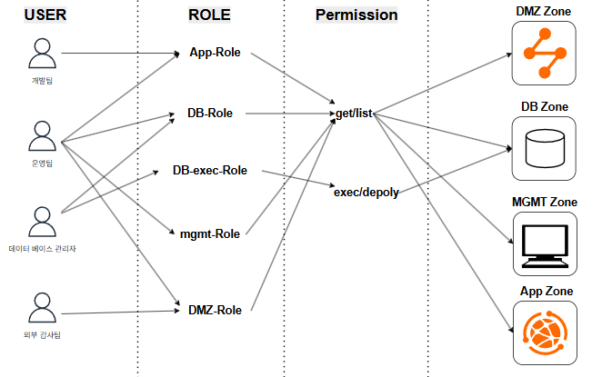
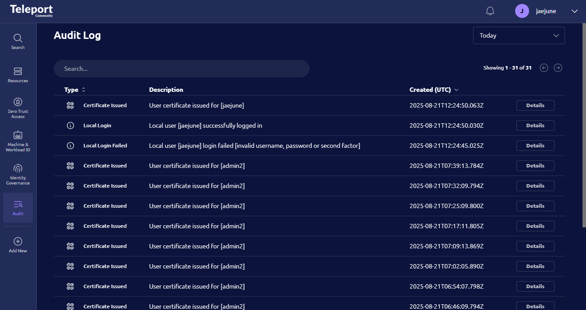
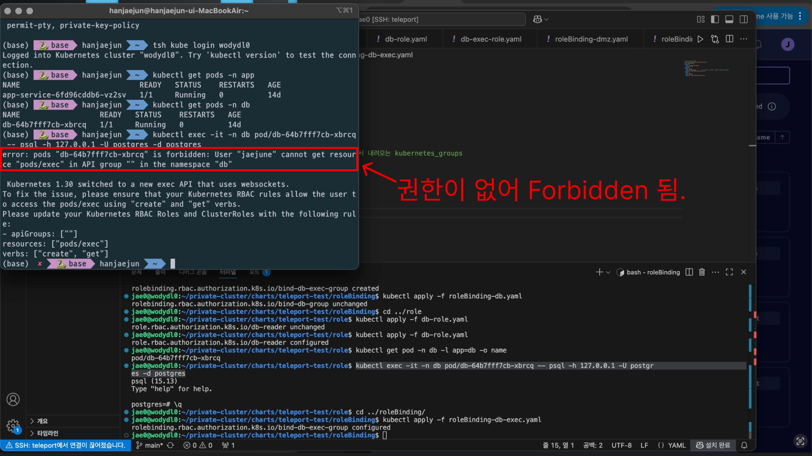
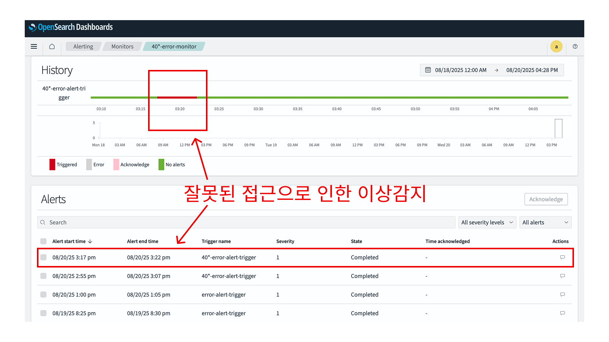

# Teleport 기반 망분리 Kubernetes 환경 보안접속 관리 체계

## 팀 정보
|  |  |  |  |
| :---: | :---: | :---: | :---: |
| 박재영(팀장) | 박지현 | 최정식 | 한재준 |
| Team Leader   Teleport Infra 구성   Root-Leaf 아키텍처 구축 | Opensearch Dashboards Detector 구현    Teleport 연동 | Logstash Pipeline 구축   Anomaly Detecting 및 Alerting 구현 | Teleport K8s Infra 구현   RBAC 설계 및 구현   Opensearch Dashboards 구성 |

---

## 프로젝트 소개

`망분리 환경에서 Teleport와 Kubernetes RBAC을 결합한 보안 접속 관리 체계`를 구현하였습니다.  
Teleport 오픈소스를 활용하여 외부 사용자는 반드시 Root Cluster Proxy를 통해서만 내부 Kubernetes 리소스에 접근할 수 있으며, 이 과정에서 RBAC를 Teleport Role과 Kubernetes RoleBinding 간 이중으로 연동하여 최소 권한 원칙을 보장하였습니다. 
또한, Teleport Audit 로그를 Logstash와 OpenSearch로 연계해 모든 접속·명령·세션 이력을 중앙에서 분석·시각화함으로써 비인가 접근 탐지 및 보안 가시성 확보를 실현하였습니다. 
이를 통해 단순한 네트워크 분리가 아닌, 접근 통제·행위 감사·실시간 모니터링이 결합된 망분리 보안 접속 관리 모델을 제시하였습니다.

---
## 시연영상
[https://www.youtube.com/watch?v=7vggGxFatCA](https://www.youtube.com/watch?v=7vggGxFatCA)

---
## 시스템 구성 및 아키텍처

#### [전체 구조 개요]
시스템의 구조는 Root Cluster(외부망, Bastion) 와 Leaf Cluster(내부망, Kubernetes)를 연결한 이중 구조입니다. 
모든 관리자는 Root의 Teleport Proxy를 통해서만 내부 Leaf에 접근하며, Root↔Leaf 간 통신은 mTLS 기반 리버스 터널로 이루어집니다. 
접속·명령·세션 등 모든 활동은 Root에서 감사 로그로 수집되어 Logstash → OpenSearch로 이어집니다.

#### [트래픽/요청 흐름(아키텍처 관점)]
1. 사용자가 Root의 Teleport Proxy로 접속합니다.
2. Teleport Proxy가 Teleport Auth와 연동해 사용자·역할을 확인합니다.
3. K8s 관련 요청은 Proxy의 3026(K8s 프록시)을 거쳐, Proxy↔Kube Agent 간 mTLS 터널로 Leaf에 전달됩니다.
4. Leaf의 Kube Agent가 K8s API에 요청을 대행하고, 응답을 동일 터널로 되돌려줍니다.
5. 이 과정의 모든 활동 로그가 Root에서 중앙 수집되어 logstash를 거쳐 opensearch로 보내어집니다.

---
## 개발 배경 및 목적

### 추진 배경
- 최근 [보안 사고(ex. SKT)](https://www.msit.go.kr/bbs/view.do?sCode=user&mId=307&mPid=208&bbsSeqNo=94&nttSeqNo=3185964)에서 드러난 기존 망분리 체계의 구조적 한계를 극복하기 위함  
- 금융위원회·금융보안원 등 공공기관이 강조한 **“행위 기록·추적, 최소 권한, 중앙 감사 체계”** [가이드라인](https://www.fsc.go.kr/no010101/82885?srchCtgry&curPage&srchKey&srchText&srchBeginDt&srchEndDt)을 충족하는 시스템 설계 필요 

### 기존 망분리 환경의 문제점
- 내부자 위협 및 권한 남용 차단 실패  
- 관리망–업무망 간 접근 경로 불투명  
- 감사 로그 부재로 인한 통제·추적 한계  

### 프로젝트 목표
- 중앙 집중형 보안 접속 관리 체계 구현  
- RBAC 이중 통제 (Teleport ↔ Kubernetes) 적용  
- 실시간 감사 및 시각화(Logstash + OpenSearch)  
- 망분리 환경의 운영 효율성과 보안성 동시 확보

---

## 개발 환경

###  1. 클라우드/서버 환경

#### Root Cluster (AWS EC2 t3.large / Ubuntu 24.04 LTS)
- Teleport Root Cluster 설치 및 Proxy/Auth 서비스 실행  
- 외부에서 유일하게 노출되는 진입점으로 `:443`, `:3024`, `:3025` 포트 개방  
- 보안 그룹에서 HTTPS(443)과 Teleport 터널링(3024, 3025, 3026) 포트만 허용  
- 방화벽으로 불필요한 인바운드 차단 → **Bastion 역할 수행**  

#### Leaf Cluster (LG U+ 홈 서버 / 이중 NAT 환경, 사설망)
- Public IP 미할당 → 외부에서 직접 접근 불가  
- `k3s v1.32.6` 기반 Kubernetes Cluster 실행  
- Teleport Kube Agent를 Pod 형태로 배포 → Root와 mTLS 기반 Reverse Tunnel로 연결  
- 네트워크 레벨에서 **Root Cluster Proxy와의 세션만 허용**  
- 방화벽 정책 :  
  - K3s API Server(6443) → 외부 비공개  
  - 내부 Pod/Service 통신만 허용  
- PoC 환경: 단일 노드로 단순화하여 운영 (필요 시 다중 노드 확장 가능)  

### 2. 소프트웨어 스택

| 구분            | 구성/버전                                           | 역할/기능                                                                 |
|-----------------|---------------------------------------------------|--------------------------------------------------------------------------|
| **Teleport**    | v17.5.6 (Open Source Edition)                     | Root Cluster → 인증/인가, 세션 로깅 Leaf Cluster → Kube Agent 배포, 내부 k8s API 접근 프록시 |
| **Helm**        | v3.18.3 / teleport-kube-agent chart v17.5.6       | Teleport 공식 Helm Chart 저장소 사용                                      |
| **CLI 도구**    | tsh, tctl, kubectl                                | 클러스터 인증, 관리, K8s 리소스 제어                                      |
| **로깅/모니터링** | OpenSearch, OpenSearch Dashboards                  | Teleport Audit Logs → Logstash 수집 → OpenSearch 저장 → Dashboards 시각화 접속 이력, K8s 리소스 접근 로그, 사용자 세션 로그 통합 관리 |

---

## 주요 기능

### 1. 망 분리 보안 접속
- 외부 사용자는 반드시 **Root Cluster Proxy**를 통해서만 Leaf Cluster 접근 가능  
- Teleport Proxy ↔ Kube Agent 간 **mTLS 터널링**으로 안전한 K8s API 접근 보장  
- 그림:  

---

### 2. RBAC 이중 연동
- **Teleport Role ↔ Kubernetes RBAC 바인딩**  
- 네임스페이스 구분: `app`, `db`, `mgmt`, `dmz`  
- 예시:  
  - App 개발자는 `app` NS만 접근 가능  
  - DBA은 `db` NS 한정  
  - Auditor는 조회만 가능 (변경 불가)  
- **최소 권한 원칙**(Principle of Least Privilege) 실현  
- 그림:  

---

### 3. 접속 감사 (Audit)
- Teleport 자체 로그로 **모든 행위 기록**
- 로그 처리 과정:  
  1. 로컬 로그 파일 저장  
  2. Logstash → OpenSearch 적재  
- 그림:  

---

### 4. 모니터링 및 이상 징후 탐지
- OpenSearch Dashboards로 **실시간 로그 시각화**  
- Error 이벤트 발생 시 **알림 기능**으로 관리자 대응 지원  
- 그림:  

---

### 5. Zone 기반 접근 제어
- 네임스페이스(`App/DB/Mgmt/DMZ`) 별 **논리적 격리 환경** 구성  
- **Teleport RBAC + Kubernetes RBAC** 이중 제어로 Zone 간 무단 접근 차단  

---

## 개발 과정

| Root Cluster | [Root Cluster README](./root-cluster/README.md) |
|-----------|------------|
| Leaf Cluster | [Leaf Cluster README](./leaf-cluster/README.md) |
| Log & Audit | [Log-audit README](./log-audit/README.md) |

---

## 결과물

- Root Cluster Web UI  
  

- RBAC Role 정의 화면  
  

- Teleport Audit Log  
  

- OpenSearch Dashboards  
  

- 비인가 접근 탐지 결과  
    
  

---

## 보안 검증 및 탐지 성과

- **Teleport 감사 로그 → OpenSearch 연계**  
  약 1,200건의 비인가 접근 시나리오 로그 이벤트를 테스트한 결과, **100% 탐지 및 감사 기록 확인**  

- **OpenSearch Dashboards 시각화**  
  사용자별 / 리소스별 접근 시도 현황을 실시간으로 확인 가능 
  → 이상 현상 실시간 탐지

- **Teleport Proxy 단일 노출 구조 적용**  
  외부에서 직접 API Server 접근 차단  
  → **불필요한 포트 노출 0건**  

- **감사 로그 이중 저장**  
  로컬 파일 + OpenSearch에 저장 → **로그 유실 0건 및 무결성 보장**  

- **주요 보안 시나리오 탐지 검증**  
  내부자 위협, 무차별 로그인 시도, 권한 오남용 등 **탐지 커버리지 100% 확인**

---

## 기대 효과 및 활용 분야

### 1. 운영 효율성
- RBAC 기반 **최소 권한 접근 제어**로 관리 편의성 향상  
- Teleport Web UI를 통한 **단일 접속 / 세션 관리**  
- **Root–Leaf 구조**로 접속 경로 단순화  

### 2. 보안성 강화
- Pod/네임스페이스 단위까지 내려가는 **세밀한 권한 통제**  
- **세션 로깅 & 명령 감사(Audit)로** 사용자 행위 추적 가능  
- 내부자 위협 및 권한 남용을 **실시간 탐지**  

### 3. 확장성과 유연성
- 다수의 Leaf Cluster를 Root에 연동하여 **멀티 클러스터 지원**  
- 퍼블릭 클라우드–온프레미스 혼합 환경 등 **하이브리드 인프라 대응**  
- Helm/IaC 기반으로 **환경 확장 및 자동화 용이**  

---

## 향후 추진 계획

### 1. Teleport RBAC ↔ Kubernetes RBAC 이중 통제 표준 템플릿 정립
- Teleport와 Kubernetes RBAC 간 **권한 매핑 및 이중 통제 체계 설계**  
  → 중복·충돌 없는 권한 관리 체계 확립  
- 사용자·역할 기반 접근제어를 **표준 템플릿화**  
  → 기관·조직 간 재사용 가능한 RBAC 운영 지침 마련  

### 2. 감사·관제 체계 고도화 (OpenSearch 기반 로그 장기 보관 및 이상탐지)
- Teleport 및 Kubernetes 이벤트 로그를 **OpenSearch로 통합 수집·저장**  
  → 장기 보관 및 규제 준수 요건 충족  
- **검색·대시보드·알림 체계 고도화**  
  → 이상 행위(비정상 접속, 권한 상승, 정책 위반 등) 자동 탐지  
- 장기 로그 관리 정책 수립  
  → 보안 감사 및 포렌식 대응 비용·시간 절감  

### 3. 운영 자동화(IaC) 및 고가용성(HA) 구조로 대규모 멀티클러스터 운영 검증
- Terraform 등 IaC 도구 활용  
  → 클러스터 배포·업데이트·정책 적용 자동화 구현  
- **HA 아키텍처 적용**  
  → Teleport Auth/Proxy 서버 및 Kubernetes Control Plane 무중단 운영 검증  
- 멀티클러스터 환경에서 **운영망·개발망·테스트망 분리**  
  → 중앙 관리 체계 확립  

---
