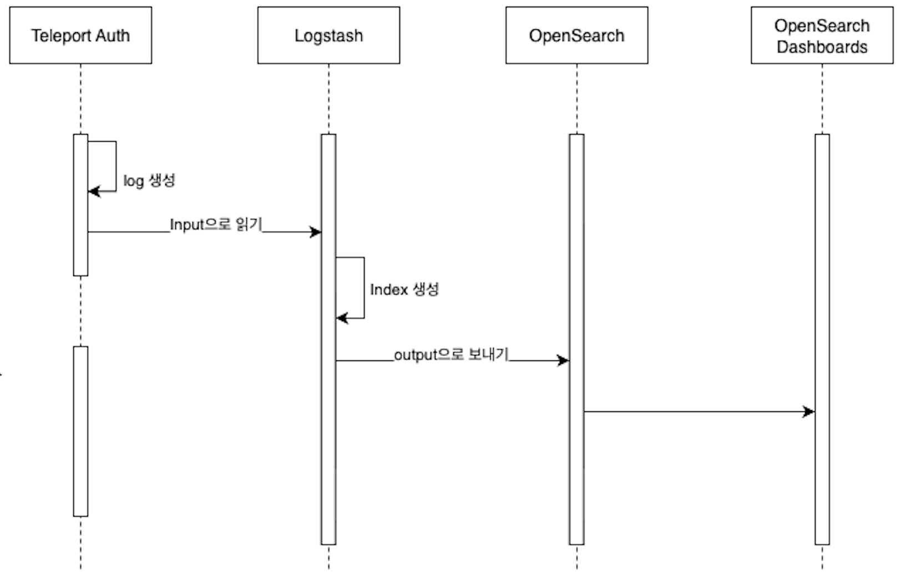
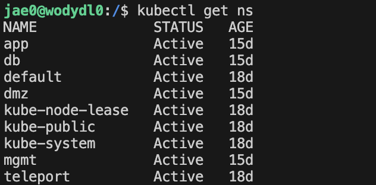
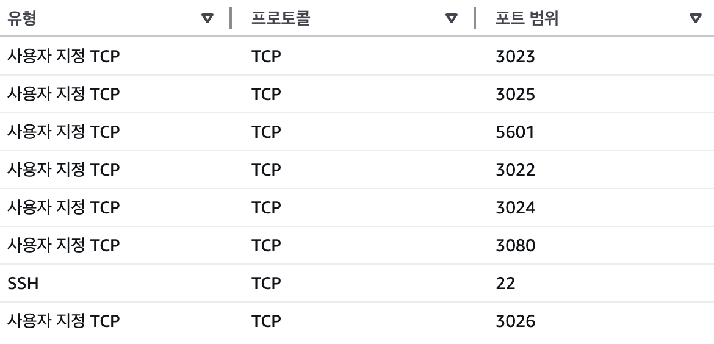
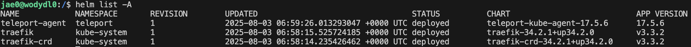
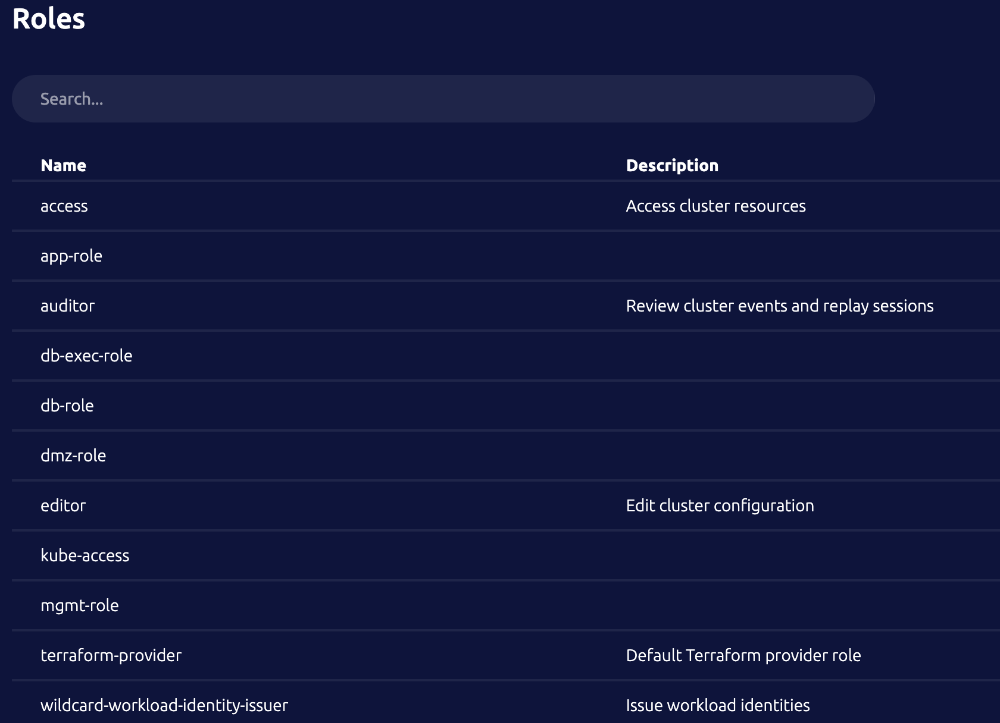
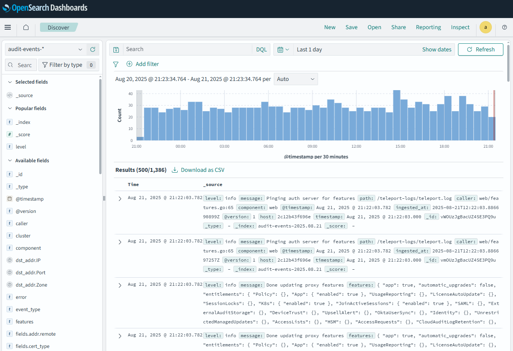

# 🛡️ Teleport 기반 망분리 Kubernetes 환경 보안접속 관리 체계

## 👥 팀 정보
- **팀 명:** 오픈소스에서 살아남기  
- **팀 인원:** 박재영, 박지현, 최정식, 한재준  
- **부문:** 학생  
- **과제 유형:** 지정 (기업, 에스코어)  

---

## 📌 프로젝트 소개

**망분리 환경에서 Teleport와 Kubernetes RBAC을 결합한 보안 접속 관리 체계**를 구현하였습니다.  
또한 OpenSearch 기반 감사 로그 분석 체계를 통해 **실시간 모니터링과 탐지**를 지원합니다.

---

## 🎯 개발 배경 및 목적

### 추진 배경
- 최근 보안 사고에서 드러난 기존 망분리 체계의 구조적 한계를 극복하기 위함  
- 금융위원회·금융보안원 등 공공기관이 강조한 **“행위 기록·추적, 최소 권한, 중앙 감사 체계”** 가이드라인을 충족하는 시스템 설계 필요  

### 기존 망분리 환경의 문제점
- 내부자 위협 및 권한 남용 차단 실패  
- 관리망–업무망 간 접근 경로 불투명  
- 감사 로그 부재로 인한 통제·추적 한계  

### 프로젝트 목표
- 중앙 집중형 보안 접속 관리 체계 구현  
- RBAC 이중 통제 (Teleport ↔ Kubernetes) 적용  
- 실시간 감사 및 시각화(Logstash + OpenSearch)  
- 망분리 환경의 **운영 효율성과 보안성 동시 확보**

---

## ⚙️ 개발 환경

- **Root Cluster**: AWS EC2 (Ubuntu 24.04 LTS)  
- **Leaf Cluster**: LG U+ 홈 서버 (사설망, k3s 단일 노드)  
- **Teleport**: v17.5.6 (OSS)  
- **Helm**: v3.18.3, 공식 Teleport Kube Agent 차트 사용  
- **CLI**: tsh, tctl, kubectl  
- **로그/모니터링**: Logstash + OpenSearch + Dashboards  

---

## 🏗️ 시스템 구성 및 아키텍처

- Root Cluster (외부망 Bastion) ↔ Leaf Cluster (내부망 k3s)  
- 모든 접근은 **Root Proxy → mTLS Reverse Tunnel → Leaf Kube Agent → K8s API**  
- Teleport 감사 로그는 Logstash → OpenSearch → Dashboards로 수집·시각화  

---

## 🔑 주요 기능

1. **망 분리 보안 접속**  
   
   - Root Proxy 단일 진입점  
   - mTLS 기반 K8s API 안전 접속  

2. **RBAC 이중 연동**  
   - Teleport Role ↔ Kubernetes RBAC 바인딩  
   - 네임스페이스(`app/db/mgmt/dmz`)별 최소 권한 접근  
   

3. **접속 감사 (Audit)**  
   - Teleport 로그 → Logstash → OpenSearch
   

4. **실시간 모니터링**  
   - OpenSearch Dashboards 시각화  
   - 비인가 접근 탐지 및 알림 기능  
   

5. **Zone 기반 접근 제어**  
   - 네임스페이스별 논리적 격리  
   - RBAC 이중 검증 구조  
   

---

## 🛠️ 개발 과정

1. **Root Cluster 구축**  
   - Teleport 설치 및 보안 그룹 최소 포트(443, 3024, 3025, 3026) 허용  
   

2. **Leaf Cluster 구성**  
   - k3s 단일 노드 환경  
   - Helm으로 Teleport Kube Agent 배포
     

3. **RBAC 연동**  
   - Teleport Role ↔ Kubernetes RoleBinding 매핑  
   

4. **엔드투엔드 접속 테스트**  
   - `tsh login → tsh kube login → kubectl get pods`  

5. **로그 수집 및 시각화**
   - Teleport Audit 로그 → Logstash → OpenSearch  
   

---

## 📦 결과물

- Root Cluster Web UI 
- RBAC Role 정의 화면   
- Teleport Audit Log 
- OpenSearch Dashboards  
- 비인가 접근 탐지 결과   

---

## 🌟 기대 효과 및 활용 분야

1. **운영 효율성**  
   - RBAC 기반 최소 권한  
   - 단일 Web UI 통합 관리  

2. **보안성 강화**  
   - Pod 단위 제어  
   - 세션 로깅 & 감사 기능 확보  

3. **확장성과 유연성**  
   - 멀티 클러스터 구조  
   - 하이브리드 인프라 대응  

4. **규제 대응력**  
   - 보안 규제 및 감사 요건 충족  

5. **실무 적용성**  
   - 실제 망분리 환경 반영  
   - 실습 모델로 활용 가능  

---

## ⚖️ 한계점 및 개선 사항
- **한계**: 단일 노드 PoC, 로그 장기 보관 정책 미흡  
- **개선**: OpenSearch 기반 보안 감시 고도화, HA 구조 확장  

---

## 💡 혁신성 및 차별성
- VPN 대비 Zero-Trust 기반 접근 제어  
- Teleport ↔ Kubernetes RBAC 이중 권한 검증  
- 오픈소스만으로 보안 접속 및 관제 체계 구현  

---

## 🔮 향후 추진 계획
- RBAC ↔ K8s 이중 통제 표준 템플릿 정립  
- OpenSearch 기반 장기 보관 
- IaC/Terraform 기반 운영 자동화 및 HA 구조 확장  

---
