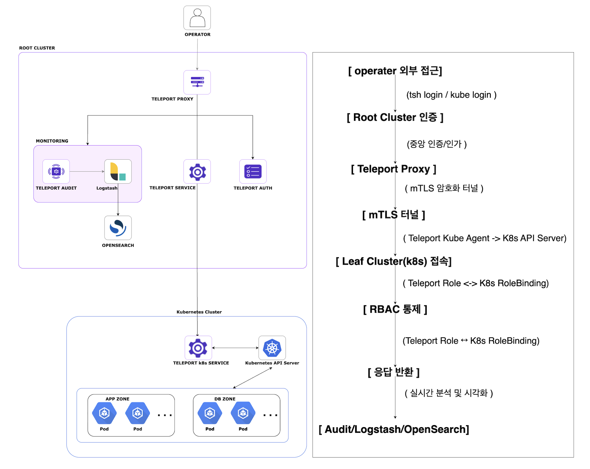

# Teleport 기반 망분리 Kubernetes 환경 보안접속 관리 체계

## 팀 정보
|  |  |  |  |
| ---------- | ----------  | ----------|  ---------- |
| 박재영(팀장) | 박지현 | 최정식 | 한재준 |
|Team Leader    Teleport Infra 구성   Root-Leaf 아키텍처 구축 | Opensearch Dashboards Detector 구현    Teleport 연동| Logstash Pipeline 구축   Anomaly Detecting 및 Alerting 구현 | Teleport K8s Infra 구현   RBAC 설계 및 구현   Opensearch Dashboards 구성  |

---

## 프로젝트 소개

`망분리 환경에서 Teleport와 Kubernetes RBAC을 결합한 보안 접속 관리 체계`를 구현하였습니다.  
Teleport 오픈소스를 활용하여 외부 사용자는 반드시 Root Cluster Proxy를 통해서만 내부 Kubernetes 리소스에 접근할 수 있으며, 이 과정에서 RBAC를 Teleport Role과 Kubernetes RoleBinding 간 이중으로 연동하여 최소 권한 원칙을 보장하였습니다. 
또한, Teleport Audit 로그를 Logstash와 OpenSearch로 연계해 모든 접속·명령·세션 이력을 중앙에서 분석·시각화함으로써 비인가 접근 탐지 및 보안 가시성 확보를 실현하였습니다. 
이를 통해 단순한 네트워크 분리가 아닌, 접근 통제·행위 감사·실시간 모니터링이 결합된 망분리 보안 접속 관리 모델을 제시하였습니다.

---
## 시스템 구성 및 아키텍처

#### [전체 구조 개요]
시스템의 구조는 Root Cluster(외부망, Bastion) 와 Leaf Cluster(내부망, Kubernetes)를 연결한 이중 구조입니다. 
모든 관리자는 Root의 Teleport Proxy를 통해서만 내부 Leaf에 접근하며, Root↔Leaf 간 통신은 mTLS 기반 리버스 터널로 이루어집니다. 
접속·명령·세션 등 모든 활동은 Root에서 감사 로그로 수집되어 Logstash → OpenSearch로 이어집니다.

#### [트래픽/요청 흐름(아키텍처 관점)]
1. 사용자가 Root의 Teleport Proxy로 접속합니다.
2. Teleport Proxy가 Teleport Auth와 연동해 사용자·역할을 확인합니다.
3. K8s 관련 요청은 Proxy의 3026(K8s 프록시)을 거쳐, Proxy↔Kube Agent 간 mTLS 터널로 Leaf에 전달됩니다.
4. Leaf의 Kube Agent가 K8s API에 요청을 대행하고, 응답을 동일 터널로 되돌려줍니다.
5. 이 과정의 모든 활동 로그가 Root에서 중앙 수집되어 logstash를 거쳐 opensearch로 보내어집니다.

---
## 개발 배경 및 목적

### 추진 배경
- 최근 [보안 사고(ex. SKT)](https://www.msit.go.kr/bbs/view.do?sCode=user&mId=307&mPid=208&bbsSeqNo=94&nttSeqNo=3185964)에서 드러난 기존 망분리 체계의 구조적 한계를 극복하기 위함  
- 금융위원회·금융보안원 등 공공기관이 강조한 **“행위 기록·추적, 최소 권한, 중앙 감사 체계”** [가이드라인](https://www.fsc.go.kr/no010101/82885?srchCtgry&curPage&srchKey&srchText&srchBeginDt&srchEndDt)을 충족하는 시스템 설계 필요 

### 기존 망분리 환경의 문제점
- 내부자 위협 및 권한 남용 차단 실패  
- 관리망–업무망 간 접근 경로 불투명  
- 감사 로그 부재로 인한 통제·추적 한계  

### 프로젝트 목표
- 중앙 집중형 보안 접속 관리 체계 구현  
- RBAC 이중 통제 (Teleport ↔ Kubernetes) 적용  
- 실시간 감사 및 시각화(Logstash + OpenSearch)  
- 망분리 환경의 운영 효율성과 보안성 동시 확보

---

## 개발 환경

- **Root Cluster**: AWS EC2 (Ubuntu 24.04 LTS)  
- **Leaf Cluster**: LG U+ 홈 서버 (사설망, k3s 단일 노드)  
- **Teleport**: v17.5.6 (OSS)  
- **Helm**: v3.18.3, 공식 Teleport Kube Agent 차트 사용  
- **CLI**: tsh, tctl, kubectl  
- **로그/모니터링**: Logstash + OpenSearch + Dashboards  

---

## 주요 기능

1. **망 분리 보안 접속**  
   - Root Proxy 단일 진입점  
   - mTLS 기반 K8s API 안전 접속
    

2. **RBAC 이중 연동**  
   - Teleport Role ↔ Kubernetes RBAC 바인딩  
   - 네임스페이스(`app/db/mgmt/dmz`)별 최소 권한 접근
   
   

3. **접속 감사 (Audit)**  
   - Teleport 로그 → Logstash → OpenSearch
   

4. **실시간 모니터링**  
   - OpenSearch Dashboards 시각화  
   - 비인가 접근 탐지 및 알림 기능  
   

5. **Zone 기반 접근 제어**  
   - 네임스페이스별 논리적 격리  
   - RBAC 이중 검증 구조  
   

---

## 개발 과정

1. **Root Cluster 구축**  
   - Teleport 설치 및 보안 그룹 최소 포트(443, 3024, 3025, 3026) 허용  
   

2. **Leaf Cluster 구성**  
   - k3s 단일 노드 환경  
   - Helm으로 Teleport Kube Agent 배포  
   

3. **RBAC 연동**  
   - Teleport Role ↔ Kubernetes RoleBinding 매핑  
   

4. **엔드투엔드 접속 테스트**  
   - `tsh login → tsh kube login → kubectl get pods`  

5. **로그 수집 및 시각화**  
   - Teleport Audit 로그 → Logstash → OpenSearch  
   

---

## 결과물

- Root Cluster Web UI  
  

- RBAC Role 정의 화면  
  

- Teleport Audit Log  
  

- OpenSearch Dashboards  
  

- 비인가 접근 탐지 결과  
    
  

---

## 기대 효과 및 활용 분야

1. **운영 효율성**  
   - RBAC 기반 최소 권한  
   - 단일 Web UI 통합 관리  

2. **보안성 강화**  
   - Pod 단위 제어  
   - 세션 로깅 & 감사 기능 확보  

3. **확장성과 유연성**  
   - 멀티 클러스터 구조  
   - 하이브리드 인프라 대응  

4. **규제 대응력**  
   - 보안 규제 및 감사 요건 충족  

5. **실무 적용성**  
   - 실제 망분리 환경 반영  
   - 실습 모델로 활용 가능  

---

## 한계점 및 개선 사항
- **한계**: 단일 노드 PoC, 로그 장기 보관 정책 미흡  
- **개선**: OpenSearch 기반 보안 감시 고도화, HA 구조 확장  

---

## 혁신성 및 차별성
- VPN 대비 Zero-Trust 기반 접근 제어  
- Teleport ↔ Kubernetes RBAC 이중 권한 검증  
- 오픈소스만으로 보안 접속 및 관제 체계 구현  

---

## 향후 추진 계획
- RBAC ↔ K8s 이중 통제 표준 템플릿 정립  
- OpenSearch 기반 장기 보관 
- IaC/Terraform 기반 운영 자동화 및 HA 구조 확장  

---
